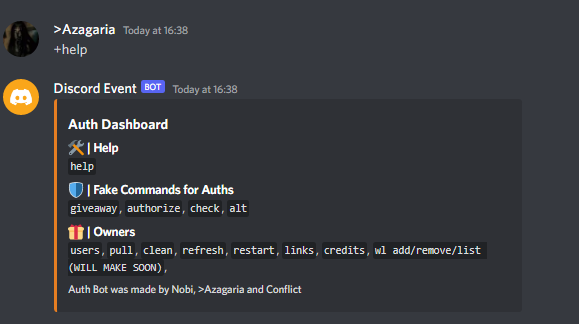

# Support my work
Please support my work 30% of it goes to the UNICEF.
+ Wallet Address: LYktD3KGx9vFdQBPaNiyUZXdJLd3Nqybyj

# Discord Authorization Bot:
Discord Authorization Bot allows people to click on a simple link and you can redirect them to any server if the bot is online. Although make sure you use the refresh command every 6 days so you do not lose them.

## Remember:
+ ``We're not responsible for anything that happens. This is a violation of Discord's Terms of Service. This is purely for educational purposes only, whatever happens is on you.``
  
## Instructions: Bot 
**In order to make this work you'll require a mongo database (I will not tell you how to make one)**

+ ``Download as a .ZIP``
+ ``Open REPLIT and put all of the files inside``
+ ``Add all the configurations shown below.``
+ ``Add a redirection url (You should see a URL when you run the bot)``
+ ``Add that redirection url in the bot with the`` **/authed** ``at the end. And the same link should be in config.``
+ ``Enable all intents on your Discord Bot``
+ ``Now just add the OAuth2 link and start the bot.``

## Instructions: Domain
+ ``Get a domain and link it to CloudFlare.``
+ ``Open replit and go to "Custom Domain"``
+ ``Link the TXT etc... to CloudFlare and wait``
+ ``Done!``

## Configurations:
**Go to config.js / .env and fill out:**

+ ``Bot Token (token, .env)``
+ ``Bot Client_ID (Config)``
+ ``Bot Client_Secret (client_secret, .env)`` 
+ ``Bot Redirect Url (Config)``
+ ``Bot Oauth2 Link (Config)``
+ ``Owner's Discord ID (Config)``
+ ``Mongo Database (mongodb, .env)``

## Features:

- ``Fake giveaway command``
- ``Fake giveaway command``
- ``Fake verify command``
- ``Fake check command``
- ``Advanced pull command``
- ``Sends users to a fake website`` I did not make that site.
- ``Open Source!``

## Creators Discord:

- ``>Azagaria#9999 (Currently have cancer)``
- ``Conflict#1000``

## Some Images:

## Changelogs:
``Version 3.0``
+ Added Webhooks!
+ Fixed fake site redirection

